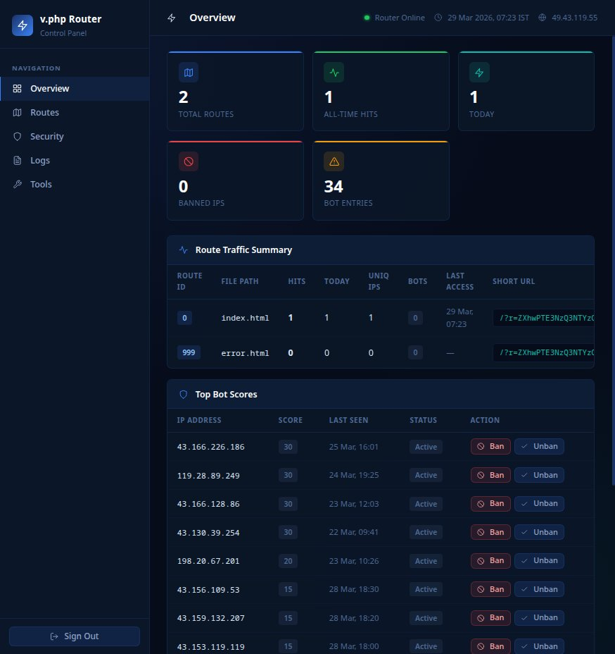

# 🛡 v.php — Enterprise Secure PHP Router

<p align="center">
  <b>Zero Trust Routing • Signed URLs • Anti-Replay • Bot Defense • Stealth Security</b>
</p>

<p align="center">
  
  
  
  
  
</p>

---

## 🚀 What is v.php?

**v.php is a high-security, single-file PHP router designed for hostile environments.**

It transforms unsafe direct access:

```
/dashboard.php
```

into a **fully verified, signed, behavior-protected request pipeline**:

```
User → Signed URL → Security Engine → Safe Resource Access
```

Every request is treated as untrusted — and must prove legitimacy.

---

## 📸 Control Panel

<p align="center">
  
</p>

The built-in control panel provides:

* Route analytics and usage tracking
* Bot activity and IP monitoring
* Route management system
* Access and security logs
* IP ban / unban controls

Access panel:

```
/?__cp__
```

---

## 🔥 Demo (Request Flow)

<p align="center">
  
</p>

**Typical flow:**

```
User → Direct File Request
     → Router Intercepts
     → Signed URL Generated
     → Redirect
     → Secure Access
```

---

## 🔥 Why This Stands Out

Unlike traditional routers, v.php is built with a **security-first architecture**, not as an afterthought.

### Core advantages:

* 🔐 Cryptographically signed URLs (HMAC SHA-256)
* 🔁 Replay attack prevention (session + IP binding)
* 🤖 Adaptive bot detection (behavior scoring engine)
* 👻 Stealth banning (fake 404 responses)
* 🌐 Network intelligence (ISP, VPN, hosting detection)
* ⚡ Zero database dependency (pure JSON storage)
* 📊 Built-in control panel (no external tools)

---

## 🧠 Security Model (Zero Trust)

```
Request
 ↓
Signature Validation
 ↓
Token Replay Protection
 ↓
Rate Limiting
 ↓
Bot Scoring Engine
 ↓
Stealth Ban System
 ↓
Secure File Resolution
 ↓
Response
```

Each layer independently enforces security — failure at any step stops execution.

---

## ⚙️ Core Features

### 🔑 Signed URL System

* Every request must contain a valid HMAC signature
* Any tampering → immediate rejection
* Supports short (`/?r=TOKEN`) and classic URLs

---

### 🔁 Replay Protection Engine

Each token is bound to:

* IP address
* Session ID
* User-Agent

Prevents:

* Link sharing abuse
* Token reuse
* Session hijacking

---

### 🤖 Adaptive Bot Detection

| Event             | Score |
| ----------------- | ----- |
| Invalid signature | +10   |
| Replay attempt    | +15   |
| Device mismatch   | +3    |
| Token leak        | +20   |

---

### 👻 Stealth Ban System

Blocked users receive:

```
HTTP 404 Not Found
```

No indication of restriction.

---

### 🌐 Network Intelligence Layer

Detects:

* Country & City
* ISP
* VPN / Proxy
* Hosting network
* Mobile network

---

### 📊 Built-in Control Panel

```
/?__cp__
```

Provides monitoring, logs, and route management.

---

## 🏗 Architecture Philosophy

> Never trust the request. Always verify.

* No direct file execution
* Single entry point
* Behavior-driven validation
* Minimal attack surface

---

## 📂 Project Structure

```
project-root/

v.php
.htaccess
error.html

cp.jpeg (Demo)
cp.gif (Demo)

.runtime/
  m.json
  u.json
  b.json
  r.json
  k.json
  x.json

  a.log
  s.log
```

---

## ⚙️ Configuration (Inside v.php)

```php
define('SIGN_SECRET', 'CHANGE_THIS');
define('SIGNED_TTL', 7200);
define('URL_MODE', 'short');
define('CP_PASSWORD', 'admin1234');
```

---

### 🔐 SIGN_SECRET

* Must be strong and random
* Used for signing
* Changing it invalidates all links

---

### 🔗 URL Modes

| Mode    | Example               |
| ------- | --------------------- |
| short   | `/?r=TOKEN`           |
| classic | `/v.php?id=1&sig=...` |

---

## 🔄 Auto-Signing Flow

```
User → direct file
     → router intercepts
     → signed URL generated
     → redirect → secure access
```

---

## 🚦 Rate Limiting

```
40 requests / 60 seconds per IP
```

---

## 📊 Logging System

### Access Log

Tracks usage and behavior

### Security Log

Tracks attacks and blocks

---

## 🚀 Installation

### 1. Upload Files

```
v.php
.htaccess
error.html
```

---

### 2. Create Runtime Directory

```
mkdir .runtime
chmod 777 .runtime
```

---

### 3. Configure

* Set `SIGN_SECRET`
* Change `CP_PASSWORD`

---

### 4. Done ✅

---

## 🔒 Apache Setup

* Route all traffic through router
* Block `.runtime` access
* Enforce HTTPS

---

## ⚡ Performance Design

* No database
* JSON-based storage
* Automatic cleanup
* Lightweight execution

---

## 🧪 Ideal Use Cases

* Secure dashboards
* Private file delivery
* Anti-leak systems
* API protection

---

## 📬 Contact

**Email:** [psvineet@zohomail.in](mailto:psvineet@zohomail.in)

---

## 📜 License

MIT License

---

## ⭐ Support

Give a star ⭐ if you find this useful.

---
